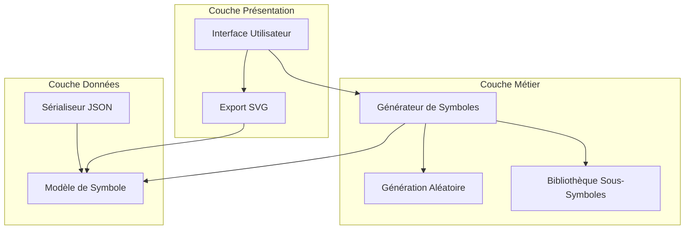

# Document de Conception Technique

## Vue d'ensemble

Ce document décrit l'architecture technique du générateur de symboles runiques. Le système permet de créer des symboles composés d'une tige verticale centrale avec des points d'ancrage sur lesquels viennent se greffer des sous-symboles décoratifs inspirés des runes nordiques.

L'architecture suit une approche modulaire avec une séparation claire entre :

- Le modèle de données (représentation des symboles)
- La logique de génération (création aléatoire ou configurée)
- Le rendu visuel (affichage et export SVG)
- La persistance (sérialisation JSON)

## Architecture



### Flux de données

1. **Génération** : L'utilisateur demande un symbole → Le générateur crée une tige → Sélectionne et place les sous-symboles → Retourne le modèle complet
2. **Rendu** : Le modèle est transformé en primitives graphiques → Rendu SVG
3. **Persistance** : Le modèle est sérialisé en JSON ↔ Désérialisé depuis JSON

## Composants et Interfaces

### SymbolGenerator

Composant principal orchestrant la génération de symboles.

```typescript
interface SymbolGenerator {
  // Génère un symbole avec configuration explicite
  generate(config: SymbolConfig): Symbol;

  // Génère un symbole aléatoire
  generateRandom(): Symbol;
}

interface SymbolConfig {
  anchorPointCount: number; // 3-7 points d'ancrage
  subSymbols: SubSymbolConfig[]; // 1-5 sous-symboles
}

interface SubSymbolConfig {
  type: SubSymbolType;
  anchorIndex: number;
  orientation: Orientation;
}
```

### SubSymbolLibrary

Bibliothèque contenant les définitions des sous-symboles disponibles.

```typescript
interface SubSymbolLibrary {
  // Retourne tous les types de sous-symboles disponibles
  getAvailableTypes(): SubSymbolType[];

  // Retourne la définition d'un sous-symbole
  getDefinition(type: SubSymbolType): SubSymbolDefinition;
}

type SubSymbolType =
  | "diagonal-left" // Trait diagonal vers la gauche
  | "diagonal-right" // Trait diagonal vers la droite
  | "branch-simple" // Branche simple
  | "branch-double" // Branche double (forme de V)
  | "hook-up" // Crochet orienté vers le haut
  | "hook-down"; // Crochet orienté vers le bas

type Orientation = "left" | "right" | "both";

interface SubSymbolDefinition {
  type: SubSymbolType;
  // Chemins SVG relatifs au point d'ancrage
  paths: {
    left?: string; // Chemin pour orientation gauche
    right?: string; // Chemin pour orientation droite
  };
}
```

### SymbolRenderer

Composant responsable du rendu visuel des symboles.

```typescript
interface SymbolRenderer {
  // Génère le SVG complet du symbole
  renderToSVG(symbol: Symbol, options?: RenderOptions): string;
}

interface RenderOptions {
  width?: number; // Largeur du SVG (défaut: 100)
  height?: number; // Hauteur du SVG (défaut: 200)
  strokeWidth?: number; // Épaisseur des traits (défaut: 3)
  strokeColor?: string; // Couleur des traits (défaut: '#000')
}
```

### SymbolSerializer

Composant gérant la persistance des symboles.

```typescript
interface SymbolSerializer {
  // Sérialise un symbole en JSON
  serialize(symbol: Symbol): string;

  // Désérialise un symbole depuis JSON
  deserialize(json: string): Symbol;
}
```

## Modèles de Données

### Symbol

Représentation complète d'un symbole généré.

```typescript
interface Symbol {
  stem: Stem;
  subSymbols: PlacedSubSymbol[];
}
```

### Stem (Tige)

La tige verticale centrale du symbole.

```typescript
interface Stem {
  // Points d'ancrage disponibles (positions Y relatives, 0 = haut, 1 = bas)
  anchorPoints: AnchorPoint[];
}

interface AnchorPoint {
  id: number;
  position: number; // Position relative sur la tige (0.0 à 1.0)
  occupied: boolean; // Indique si un sous-symbole est attaché
}
```

### PlacedSubSymbol

Un sous-symbole placé sur la tige.

```typescript
interface PlacedSubSymbol {
  type: SubSymbolType;
  anchorPointId: number;
  orientation: Orientation;
}
```

### Format JSON de sérialisation

```json
{
  "version": "1.0",
  "stem": {
    "anchorPoints": [
      { "id": 0, "position": 0.15 },
      { "id": 1, "position": 0.35 },
      { "id": 2, "position": 0.55 },
      { "id": 3, "position": 0.75 },
      { "id": 4, "position": 0.95 }
    ]
  },
  "subSymbols": [
    { "type": "diagonal-left", "anchorPointId": 1, "orientation": "both" },
    { "type": "hook-up", "anchorPointId": 3, "orientation": "right" }
  ]
}
```

## Propriétés de Correction

_Une propriété est une caractéristique ou un comportement qui doit rester vrai pour toutes les exécutions valides d'un système — essentiellement, une déclaration formelle de ce que le système doit faire. Les propriétés servent de pont entre les spécifications lisibles par l'humain et les garanties de correction vérifiables par la machine._

### Propriété 1 : Présence de la tige

_Pour tout_ symbole généré, le symbole doit contenir une tige (stem) non nulle.

**Valide : Exigence 1.1**

### Propriété 2 : Nombre de points d'ancrage

_Pour tout_ symbole généré, le nombre de points d'ancrage sur la tige doit être compris entre 3 et 7 inclus.

**Valide : Exigence 1.3**

### Propriété 3 : Nombre de sous-symboles

_Pour tout_ symbole généré (aléatoire ou configuré), le nombre de sous-symboles attachés doit être compris entre 1 et 5 inclus.

**Valide : Exigences 2.1, 4.1**

### Propriété 4 : Validité du placement

_Pour tout_ sous-symbole placé dans un symbole, l'identifiant du point d'ancrage référencé doit correspondre à un point d'ancrage existant sur la tige.

**Valide : Exigences 2.2, 4.3**

### Propriété 5 : Unicité des points d'ancrage

_Pour tout_ symbole généré, chaque point d'ancrage ne peut être utilisé que par un seul sous-symbole (les anchorPointId des sous-symboles doivent être uniques).

**Valide : Exigence 2.3**

### Propriété 6 : Limitation par les points d'ancrage

_Pour toute_ configuration demandant plus de sous-symboles que de points d'ancrage disponibles, le nombre de sous-symboles dans le symbole résultant doit être inférieur ou égal au nombre de points d'ancrage.

**Valide : Exigence 2.4**

### Propriété 7 : Validité de l'orientation

_Pour tout_ sous-symbole placé, son orientation doit être l'une des valeurs valides : 'left', 'right' ou 'both'.

**Valide : Exigences 3.5, 4.4**

### Propriété 8 : Types de sous-symboles valides

_Pour tout_ sous-symbole placé dans un symbole généré aléatoirement, son type doit appartenir à l'ensemble des types définis dans la bibliothèque.

**Valide : Exigence 4.2**

### Propriété 9 : Validité du SVG généré

_Pour tout_ symbole valide, le rendu SVG doit produire un document SVG syntaxiquement correct et parsable.

**Valide : Exigences 5.1, 6.2**

### Propriété 10 : Uniformité de l'épaisseur de trait

_Pour tout_ symbole rendu en SVG, tous les éléments graphiques (tige et sous-symboles) doivent avoir la même valeur de stroke-width.

**Valide : Exigence 5.4**

### Propriété 11 : Round-trip de sérialisation

_Pour tout_ symbole valide, la sérialisation en JSON suivie de la désérialisation doit produire un symbole équivalent à l'original.

**Valide : Exigence 7.4**

## Gestion des Erreurs

### Erreurs de configuration

| Erreur                    | Condition                                 | Message                                                                 |
| ------------------------- | ----------------------------------------- | ----------------------------------------------------------------------- |
| `InvalidAnchorPointCount` | Nombre de points d'ancrage < 3 ou > 7     | "Le nombre de points d'ancrage doit être entre 3 et 7"                  |
| `InvalidSubSymbolCount`   | Nombre de sous-symboles < 1 ou > 5        | "Le nombre de sous-symboles doit être entre 1 et 5"                     |
| `InvalidAnchorPointId`    | Référence à un point d'ancrage inexistant | "Point d'ancrage {id} non trouvé"                                       |
| `DuplicateAnchorPoint`    | Deux sous-symboles sur le même point      | "Le point d'ancrage {id} est déjà occupé"                               |
| `UnknownSubSymbolType`    | Type de sous-symbole non reconnu          | "Type de sous-symbole inconnu : {type}"                                 |
| `InvalidOrientation`      | Orientation non valide                    | "Orientation invalide : {value}. Valeurs acceptées : left, right, both" |

### Erreurs de sérialisation

| Erreur                   | Condition                                   | Message                                                          |
| ------------------------ | ------------------------------------------- | ---------------------------------------------------------------- |
| `InvalidJsonSyntax`      | JSON mal formé                              | "Erreur de syntaxe JSON : {details}"                             |
| `MissingRequiredField`   | Champ obligatoire absent                    | "Champ requis manquant : {field}"                                |
| `InvalidFieldType`       | Type de champ incorrect                     | "Type invalide pour {field} : attendu {expected}, reçu {actual}" |
| `InvalidSymbolStructure` | Structure du symbole invalide après parsing | "Structure de symbole invalide : {details}"                      |

### Erreurs d'export

| Erreur        | Condition          | Message                                |
| ------------- | ------------------ | -------------------------------------- |
| `RenderError` | Échec du rendu SVG | "Erreur lors du rendu SVG : {details}" |
| `ExportError` | Échec de l'export  | "Erreur lors de l'export : {details}"  |

## Stratégie de Test

### Approche duale

La stratégie de test combine deux approches complémentaires :

1. **Tests unitaires** : Vérifient des exemples spécifiques, cas limites et conditions d'erreur
2. **Tests basés sur les propriétés** : Vérifient les propriétés universelles sur un grand nombre d'entrées générées aléatoirement

### Bibliothèque de test

- **Framework de test** : Vitest (ou Jest)
- **Tests basés sur les propriétés** : fast-check

### Configuration des tests de propriétés

- Minimum 100 itérations par test de propriété
- Chaque test doit référencer la propriété du document de conception
- Format de tag : `Feature: symbol-generator, Property {number}: {property_text}`

### Plan de tests unitaires

| Test                     | Description                                                          | Exigence |
| ------------------------ | -------------------------------------------------------------------- | -------- |
| Création tige basique    | Vérifie qu'une tige est créée avec le bon nombre de points d'ancrage | 1.1, 1.3 |
| Bibliothèque complète    | Vérifie que la bibliothèque contient les 6 types requis              | 3.1-3.4  |
| Génération avec config   | Vérifie la génération avec une configuration explicite               | 2.1-2.3  |
| Limitation sous-symboles | Vérifie la limitation quand trop de sous-symboles demandés           | 2.4      |
| Export SVG valide        | Vérifie qu'un symbole simple produit un SVG valide                   | 5.1, 6.2 |
| Erreur JSON invalide     | Vérifie le message d'erreur pour un JSON mal formé                   | 7.3      |
| Erreur champ manquant    | Vérifie le message d'erreur pour un champ manquant                   | 7.3      |

### Plan de tests de propriétés

| Propriété | Description                                 | Tag                                                                          |
| --------- | ------------------------------------------- | ---------------------------------------------------------------------------- |
| 1         | Présence de la tige                         | `Feature: symbol-generator, Property 1: Présence de la tige`                 |
| 2         | Nombre de points d'ancrage entre 3 et 7     | `Feature: symbol-generator, Property 2: Nombre de points d'ancrage`          |
| 3         | Nombre de sous-symboles entre 1 et 5        | `Feature: symbol-generator, Property 3: Nombre de sous-symboles`             |
| 4         | Validité du placement sur points d'ancrage  | `Feature: symbol-generator, Property 4: Validité du placement`               |
| 5         | Unicité des points d'ancrage utilisés       | `Feature: symbol-generator, Property 5: Unicité des points d'ancrage`        |
| 6         | Limitation par les points d'ancrage         | `Feature: symbol-generator, Property 6: Limitation par les points d'ancrage` |
| 7         | Validité de l'orientation                   | `Feature: symbol-generator, Property 7: Validité de l'orientation`           |
| 8         | Types de sous-symboles dans la bibliothèque | `Feature: symbol-generator, Property 8: Types de sous-symboles valides`      |
| 9         | SVG syntaxiquement valide                   | `Feature: symbol-generator, Property 9: Validité du SVG généré`              |
| 10        | Uniformité stroke-width                     | `Feature: symbol-generator, Property 10: Uniformité de l'épaisseur de trait` |
| 11        | Round-trip sérialisation JSON               | `Feature: symbol-generator, Property 11: Round-trip de sérialisation`        |

### Générateurs pour fast-check

```typescript
// Générateur de symbole valide
const symbolArbitrary = fc.record({
  stem: fc.record({
    anchorPoints: fc.array(
      fc.record({
        id: fc.nat(),
        position: fc.double({ min: 0, max: 1 }),
        occupied: fc.boolean(),
      }),
      { minLength: 3, maxLength: 7 },
    ),
  }),
  subSymbols: fc.array(
    fc.record({
      type: fc.constantFrom(
        "diagonal-left",
        "diagonal-right",
        "branch-simple",
        "branch-double",
        "hook-up",
        "hook-down",
      ),
      anchorPointId: fc.nat(),
      orientation: fc.constantFrom("left", "right", "both"),
    }),
    { minLength: 1, maxLength: 5 },
  ),
});
```
